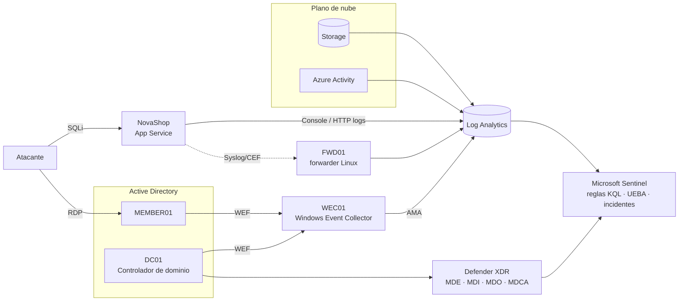

# GDAT · Laboratorio SOC en Azure

> Detección y respuesta como código sobre Microsoft Sentinel, Defender XDR y Active Directory.
> Despliegas el entorno, lanzas un ataque real de principio a fin y lo detectas con reglas en KQL mapeadas a MITRE ATT&CK.


## Qué es

Un laboratorio SOC reproducible en Azure, desplegado como código con Bicep. Monta un dominio
Active Directory, los colectores de telemetría (WEF y Syslog/CEF), un workspace de Log Analytics
con Microsoft Sentinel y la capa de Microsoft 365 / Defender XDR, junto a **NovaShop**, una
aplicación web deliberadamente vulnerable que hace de punto de entrada.

Sobre ese entorno se ejecuta una cadena de ataque completa y se detecta cada paso con reglas
analíticas escritas en KQL, versionadas en el repositorio y mapeadas a MITRE ATT&CK. El
*entity mapping* correlaciona todas las alertas de la misma cadena en un único incidente de
Sentinel.

## Arquitectura



## La historia que cuenta el laboratorio

Una intrusión que empieza en la web y termina en el compromiso del dominio, detectada paso a paso:

```
SQLi en NovaShop  →  robo de credenciales  →  RDP a MEMBER01
     →  enumeración de SPN  →  Kerberoasting de svc-sql  →  escalada  →  DCSync
```

Cada eslabón deja telemetría en una fuente distinta (HTTP, eventos de Windows, Azure Activity,
Storage) y dispara su propia regla; el entity mapping (IP, cuenta, host) las une en un solo
incidente, desde la intrusión web hasta la extracción de hashes del dominio.

## Detecciones (KQL → MITRE ATT&CK)

| # | Detección | Fuente de telemetría | MITRE ATT&CK | Regla |
|---|-----------|----------------------|--------------|-------|
| 1 | SQL injection en NovaShop | App Service (telemetría propia) | [T1190](https://attack.mitre.org/techniques/T1190/) Exploit Public-Facing Application | [`01-sqli-novashop.kql`](biceps/queries/01-sqli-novashop.kql) |
| 2 | Kerberoasting | Windows Security 4769 (RC4) | [T1558.003](https://attack.mitre.org/techniques/T1558/003/) | [`02-kerberoasting.kql`](biceps/queries/02-kerberoasting.kql) |
| 3 | Alta en grupo privilegiado | Windows Security 4728 / 4732 | [T1098](https://attack.mitre.org/techniques/T1098/) Account Manipulation | [`03-grupo-privilegiado.kql`](biceps/queries/03-grupo-privilegiado.kql) |
| 4 | Exfiltración a Storage | StorageBlobLogs (PutBlob) | [T1537](https://attack.mitre.org/techniques/T1537/) Transfer Data to Cloud Account | [`04-exfiltracion-storage.kql`](biceps/queries/04-exfiltracion-storage.kql) |
| 5 | Creación sospechosa de recursos | Azure Activity | [T1578](https://attack.mitre.org/techniques/T1578/) Modify Cloud Compute Infra. | [`05-creacion-recursos.kql`](biceps/queries/05-creacion-recursos.kql) |
| 6 | RDP entrante desde Internet | Windows Security 4624 (LogonType 10) | [T1021.001](https://attack.mitre.org/techniques/T1021/001/) Remote Services: RDP | [`06-rdp-entrante.kql`](biceps/queries/06-rdp-entrante.kql) |
| 7 | DCSync | Windows Security 4662 (derechos de replicación) | [T1003.006](https://attack.mitre.org/techniques/T1003/006/) OS Credential Dumping: DCSync | [`07-dcsync-4662.kql`](biceps/queries/07-dcsync-4662.kql) |

La detección de DCSync se valida de extremo a extremo: SACL del dominio con los GUID de
replicación, filtrado del evento 4662 en la DCR por XPath para no pagar ingesta de ruido y
exclusión de la replicación legítima entre controladores.

## Qué demuestra

- **Infraestructura como código**: todo el entorno (red, AD, colectores, Sentinel, detecciones) en Bicep, reproducible y con `teardown`.
- **Detection engineering**: reglas KQL propias, con entity mapping para correlacionar una cadena de ataque en un único incidente.
- **Enfoque de atacante aplicado a la defensa**: cada regla se valida lanzando el ataque real que debe detectar.
- **Operación consciente del coste**: presupuesto con alertas, VMs Spot para caber en la cuota de 4 vCPU y comprobaciones automáticas de que la telemetría llega a las tablas.

## Componentes

| Carpeta | Contenido |
|---------|-----------|
| [`biceps/`](biceps/) | Infraestructura como código: `main.bicep` y 20 módulos, scripts de despliegue, configuración de M365/WEF/auditoría y las 7 reglas KQL |
| [`biceps/novashop/`](biceps/novashop/) | NovaShop: aplicación web vulnerable (SQLi, IDOR/BOLA, XSS) con telemetría estructurada y modo vulnerable/remediado |
| [`gdat/BUILD_GDAT2.0.md`](gdat/BUILD_GDAT2.0.md) | Guía de despliegue de 21 fases: construir, atacar, detectar y desmontar |

## Despliegue rápido

```bash
cd biceps
source ./cargar-secretos.sh     # genera las contraseñas del lab en .env.local (fuera de Git)
./deploy.sh preparar            # registra los resource providers necesarios
./deploy.sh preview             # compila y muestra what-if, sin tocar nada
./deploy.sh desplegar
./deploy.sh publicar-app        # publica NovaShop
./deploy.sh validar             # espera a que las tablas respondan
./deploy.sh destruir            # teardown completo
```

Guía detallada y capa de Microsoft 365 / identidad en [`biceps/README.md`](biceps/README.md)
y [`gdat/BUILD_GDAT2.0.md`](gdat/BUILD_GDAT2.0.md).

<!-- Capturas: incidente correlacionado en Sentinel y advanced hunting. Pendientes de anadir (anonimizadas). -->
